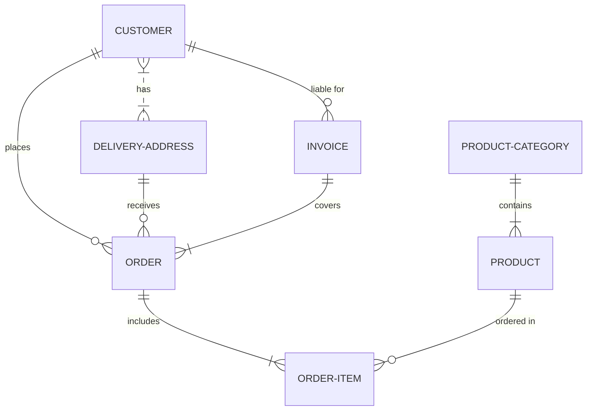

# Proyecto de Estudio!

**Estructura del documento principal:**

# PRESENTACIÓN (Gestion de servicio tecnico)

**Asignatura**: Bases de Datos I (FaCENA-UNNE)

**Integrantes**:

- Boneta, Hiras
- Cabral, Braian
- De Los Santos, Francisco
- Echeverria, Theo

**Profesor**: Walter Vallejos

**Institucion**: Universidad Nacional del Nordeste

**Carrera**: Licenciatura en Sistemas de Informacion

**Año**: 2024

**Fecha**: 2/10/2024

## CAPÍTULO I: INTRODUCCIÓN

### Caso de estudio

En un negocio de servicio de reparacion de equipos electronicos se utiliza un flujo de trabajo desde que un cliente lleva su dispositivo para ser reparado, hasta que este es devuelto al cliente. En medio de esos dos eventos, el equipo pasa por un proceso de revision, de asignacion de presupuesto (el cual es analizado por un administrador del negocio) para reparar el dispositivo y finalmente pasa por su reparacion y es entregado al cliente.
El negocio trabaja con un conjunto de marcas preestablecidas, las cuales son Canon, Toshiba y Kyocera. Los tipos de dispositivos con los que se trabaja tambien estan preestablecidos, estos son: Impresoras, tanto laser como de inyeccion de tinta, fotocopiadoras y computadoras portatiles.
El personal que trabaja en la empresa puede ser de tres tipos: Master (que solo existe uno), Administrador y Tecnico. El usuario Master se encarga de dar de alta o de baja a los otros dos usuarios (administrador y tecnico). El administrador se encarga de ingresar los datos de los clientes que llegan al negocio y de los equipos que estos traen para reparacion, de aprobar o rechazar un presupuesto para la reparacion de un equipo, de aprobar la entrega de un equipo y generar un informe sobre el mismo. El tecnico se encarga de generar una revision de un equipo despues de su analisis, y de marcar un equipo como reparado.
Los equipos tienen un estado dependiendo de en que fase de su ciclo de vida a traves del negocio se encuentran, estos pueden estar: Pendiente de revision, en revision, pendiente de presupuesto, a la espera de aprobacion de presupuesto, pendiente de reparacion, en reparacion, listo para la entrega o irreparable. A un equipo solo le puede ser asignado un unico tecnico, asi como tambien un equipo solo puede tener una revision asociada al mismo.
Hay ciertos datos que resultan reelevantes para el negocio como ser:

- Sobre los clientes: DNI, apellido/s, nombre/s, telefono y correo.
- Sobre los equipos: Cliente, tipo de equipo, numero de serie, marca, modelo, observaciones (opcional), razon de ingreso, si el equipo a la hora de ingresar y estado del equipo.

### Definición o planteamiento del problema

Dado a que el negocio actualmente gestiona su flujo de trabajo a traves del uso de documentos fisicos, se encuentra la problematica de que los documentos se pierden, se dañan, llegan a destiempo y producen problemas en la dinamica de trabajo. En resumen: el hecho de trabajar con documentos fisicos genera deficiencias temporales que necesitan ser solventadas.

### Objetivo

- Objetivos generales: Se desea construir una base de datos para guardar toda la informacion relevante que actualmente el negocio gestiona de forma fisica, atendiendo a los datos relevantes para ellos y ayudando asi a la eficiencia del flujo de trabajo.
- Objetivos especificos: Que la empresa pueda organizar su flujo de trabajo, tener a su alcance de manera rapida la informacion de sus equipos, clientes y el estado de los mismos, optimizar al maximo la informacion relevante, mejorar el seguimiento de los equipos que son ingresados, que este disponible la informacion de manera rapida a la hora de generar un informe sobre los equipos que son devueltos a los clientes y tener un historial de los equipos, clientes y presupuestos que fueron trabajados.

## CAPITULO II: MARCO CONCEPTUAL O REFERENCIAL

**TEMA 1 " ---- "**
Ut sed imperdiet risus. Maecenas vestibulum arcu vitae orci pretium pharetra. Suspendisse potenti. Fusce massa libero, fermentum eget elit in, tincidunt fermentum nunc. Cras imperdiet nisl elit, elementum gravida enim accumsan vel. Sed in sapien quis ante consectetur commodo id non nulla. Aenean lacinia, dolor convallis semper mattis, ante orci elementum nunc, eget feugiat risus neque in urna. Ut ut quam nec risus mollis convallis ornare ac odio. Phasellus efficitur posuere nibh, eget tempor augue pellentesque ac. Ut enim sem, imperdiet non est ut, blandit posuere dui. Curabitur at purus orci. Interdum et malesuada fames ac ante ipsum primis in faucibus.

**TEMA 2 " Procedimientos y Funciones Almacenadas "**
- En esta sección, vamos a abordar distintos puntos respecto a los procedimientos y funciones almacenadas dentro de SQL server.
- Se hará una no muy extensa presentación sobre los conceptos referidos a cada uno, sus tipos y las ventajas que posee el utilizar estas funciones o procedimientos, a comparación de las operaciones directas.
  
***DEFINICIONES***
  
  ****Procedimientos Almacenados****
  - Un procedimiento almacenado de SQL Server es un grupo de una o varias instrucciones Transact-SQL. Donde una instrucción Transact-SQL (T-SQL) es una orden que       le das a SQL Server para que haga algo en la base de datos (sea agregar datos, obtener información de la base de datos, actualizar datos, eliminar datos.          Además también se puede definir condiciones, usar bucles y hacer transacciones).
  - Éstos procedimientos almacenados pueden:
      -	Aceptar parámetros de entrada y devolver varios valores en forma de parámetros de salida al programa que realiza la llamada.
      -	Contener instrucciones de programación que realicen operaciones en la base de datos. Entre otras, pueden contener llamadas a otros procedimientos.
      -	Devolver un valor de estado a un programa que realiza una llamada para indicar si la operación se ha realizado correctamente o se han producido errores, y         el motivo de estos.

  ****Funciones Almacenadas****
  - Una función almacenada en SQL es un conjunto de instrucciones que se agrupan para realizar una tarea específica en la base de datos. Las funciones almacenadas     son similares a los procedimientos almacenados, pero tienen algunas diferencias clave:
        -	Una función siempre devuelve un valor, a diferencia de los procedimientos almacenados, que pueden no devolver nada.
        -	Las funciones pueden usarse directamente en consultas SQL (como en SELECT, WHERE, etc.), mientras que los procedimientos almacenados no pueden.
        -	Una función puede devolver un solo valor de tipo de datos o una tabla (en el caso de las funciones de tipo tabla).
    
***TIPOS***

****Procedimientos Almacenados****
 
	Procedimientos almacenados del usuario 
		- Son procedimientos definidos por el usuario y se diseñaron para realizar tareas específicas en la base de datos. Son los más comunes y los 	que usualmente se crean para manejar operaciones en la base de datos como insertar, actualizar, eliminar o consultar datos.

	Procedimientos almacenados del sistema
 		- Son procedimientos definidos por SQL Server y están diseñados para realizar tareas administrativas y de mantenimiento en la base de datos. Estos procedimientos pueden ser 		invocados directamente sin necesidad de ser definidos por el usuario Por ejemplo: sp_help: Muestra información sobre objetos de base de datos. sp_adduser: Agrega un nuevo 		usuario a la base de datos. sp_configure: Configura opciones del servidor.

	Procedimientos Temporales 
		- Son una variación de procedimientos definidos por el usuario, pero se almacenan en una base de datos especial llamada tempdb. Son útiles cuando se necesita crear 			procedimientos que solo existan durante una sesión o para realizar tareas temporales y específicas. 
			- Por ejemplo: 
				Locales: Se identifican con un solo signo de número (#) al principio del nombre del procedimiento. Son visibles solo para la conexión del usuario que los 				creó. Se eliminan automáticamente cuando se cierra la conexión. Ejemplo: #MiProcedimientoTemporal 
				Globales: Se identifican con doble signo de número (##) al principio del nombre del procedimiento. Son visibles para cualquier usuario que tenga acceso a la 				base de datos y se eliminan automáticamente después de que se cierre la última conexión que esté utilizando el procedimiento. Ejemplo 							##MiProcedimientoGlobal

	Procedimientos Extendidos Definidos por el Usuario 
		- Los procedimientos extendidos definidos por el usuario son bibliotecas externas (DLL) que puedes cargar y ejecutar desde SQL Server. Estos procedimientos permiten 			realizar operaciones más complejas que no se pueden hacer directamente con Transact-SQL.

****Funciones Almacenadas****

	Funciones escalares 
		- Descripción: Las funciones escalares son las más comunes. Devuelven un único valor de un tipo de datos específico (como int, varchar, date, etc.). Uso: Se utilizan en 		consultas para devolver un valor calculado. Por ejemplo, una función que calcule el salario total de un empleado sumando varias columnas.

	Funciones de tabla 
		- Descripción: Las funciones de tabla devuelven un conjunto de resultados, es decir, una tabla completa. A diferencia de las funciones escalares, no devuelven un único 		valor, sino que pueden devolver filas y columnas como una tabla virtual. Uso: Se utilizan cuando necesitas devolver varias filas o un conjunto de datos basado en un 			conjunto de condiciones.

	Funciones agregadas 
		- Descripción: Son funciones que realizan una operación de agregación, como contar, promediar, sumar, encontrar el máximo o el mínimo. Uso: Se utilizan para realizar 			cálculos agregados dentro de una consulta.

***VENTAJAS***

Procedimientos y Funciones Almacenadas

	Mayor seguridad 
		- Se limita el acceso a las tablas y otros objetos de base de datos a través de éstos procedimientos y funciones, en lugar de dar acceso directo a cada tabla o comando. 	Reutilización del código 
		- Se puede encapsular operaciones comunes en la base de datos dentro de un proceso similar para evitar escribir el código repetidas veces en diferentes partes de una 			aplicación. 
	Trafico de red reducido 
		- Se refiere a que usar los procedimientos almacenados, el cliente, solo envía una llamada única al procedimiento almacenado en el servidor, en lugar de enviar múltiples 		comandos SQL individuales. 
	Simple mantenimiento 
		- Si necesitas modificar algo en la lógica de una operación, lo cambias solo una vez dentro de la función almacenada. Seguís llamando al mismo procedimiento sin tener que 		preocuparte por la lógica interna. Esto hace que el mantenimiento sea más sencillo, ya que solo se cambia la base de datos y no el código de la aplicación. 
	Rendimiento mejorado 
		- De forma predeterminada, un procedimiento se compila la primera vez que se ejecuta y crea un plan de ejecución que vuelve a usarse en posteriores ejecuciones. Como el 		procesador de consultas no tiene que crear un nuevo plan, normalmente necesita menos tiempo para procesar el procedimiento.

## CAPÍTULO III: METODOLOGÍA SEGUIDA

Donec lobortis tincidunt erat, non egestas mi volutpat in. Cras ante purus, luctus sed fringilla non, ullamcorper at eros.

**a) Cómo se realizó el Trabajo Práctico**
Vestibulum rutrum feugiat molestie. Nunc id varius augue. Ut augue mauris, venenatis et lacus ut, mattis blandit urna. Fusce lobortis, quam non vehicula scelerisque, nisi enim ultrices diam, ac tristique libero ex nec orci.

**b) Herramientas (Instrumentos y procedimientos)**
Donec lobortis tincidunt erat, non egestas mi volutpat in. Cras ante purus, luctus sed fringilla non, ullamcorper at eros. Integer interdum id orci id rutrum. Curabitur facilisis lorem sed metus interdum accumsan.

## CAPÍTULO IV: DESARROLLO DEL TEMA / PRESENTACIÓN DE RESULTADOS

Maecenas molestie lacus tincidunt, placerat dolor et, ullamcorper erat. Mauris tortor nisl, ultricies ac scelerisque nec, feugiat in nibh. Pellentesque interdum aliquam magna sit amet rutrum.

### Diagrama conceptual (opcional)

Ejemplo usando Live Editor https://mermaid.js.org/ (ejemplo opcional)

### Diagrama relacional

### Diccionario de datos

Acceso al documento [PDF](doc/diccionario_datos.pdf) del diccionario de datos.

### Script de definicion de datos

Acceso al documento [SQL](script/script_ddl_proyecto.sql) del script.

### Desarrollo TEMA 1 "----"

Fusce auctor finibus lectus, in aliquam orci fermentum id. Fusce sagittis lacus ante, et sodales eros porta interdum. Donec sed lacus et eros condimentum posuere.

> Acceder a la siguiente carpeta para la descripción completa del tema [scripts-> tema_1](script/tema01_nombre_tema)

### Desarrollo TEMA 2 "----"

Proin aliquet mauris id ex venenatis, eget fermentum lectus malesuada. Maecenas a purus arcu. Etiam pellentesque tempor dictum.

> Acceder a la siguiente carpeta para la descripción completa del tema [scripts-> tema_2](script/tema02_nombre_tema)

...

## CAPÍTULO V: CONCLUSIONES

Nunc sollicitudin purus quis ante sodales luctus. Proin a scelerisque libero, vitae pharetra lacus. Nunc finibus, tellus et dictum semper, nisi sem accumsan ligula, et euismod quam ex a tellus.

## BIBLIOGRAFÍA DE CONSULTA

### TEMA 2
- https://learn.microsoft.com/es-es/sql/t-sql/language-reference?view=sql-server-ver15
- https://learn.microsoft.com/es-es/sql/relational-databases/stored-procedures/stored-procedures-database-engine?view=sql-server-ver16
- https://learn.microsoft.com/es-es/sql/relational-databases/user-defined-functions/user-defined-functions?view=sql-server-ver15
- https://learn.microsoft.com/es-es/sql/relational-databases/stored-procedures/create-a-stored-procedure?view=sql-server-ver16
- https://learn.microsoft.com/en-us/sql/relational-databases/user-defined-functions/create-user-defined-functions-database-engine?view=sql-server-ver16
