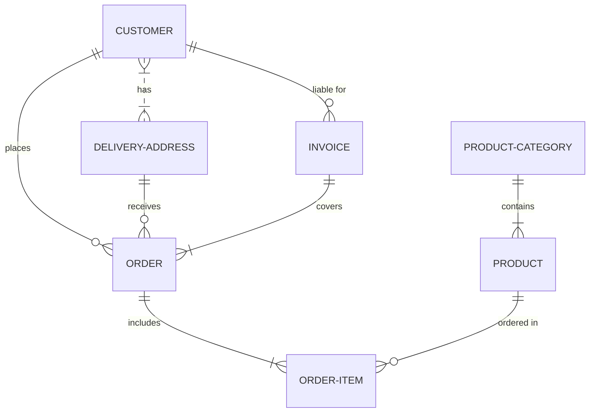

# Proyecto de Estudio!

**Estructura del documento principal:**

# PRESENTACIÓN (Gestion de servicio tecnico)

**Asignatura**: Bases de Datos I (FaCENA-UNNE)

**Integrantes**:

- Boneta, Hiras
- Cabral, Braian
- De Los Santos, Francisco
- Echeverria, Theo

**Profesor**: Walter Vallejos

**Institucion**: Universidad Nacional del Nordeste

**Carrera**: Licenciatura en Sistemas de Informacion

**Año**: 2024

**Fecha**: 2/10/2024

## CAPÍTULO I: INTRODUCCIÓN

### Caso de estudio

En un negocio de servicio de reparacion de equipos electronicos se utiliza un flujo de trabajo desde que un cliente lleva su dispositivo para ser reparado, hasta que este es devuelto al cliente. En medio de esos dos eventos, el equipo pasa por un proceso de revision, de asignacion de presupuesto (el cual es analizado por un administrador del negocio) para reparar el dispositivo y finalmente pasa por su reparacion y es entregado al cliente.
El negocio trabaja con un conjunto de marcas preestablecidas, las cuales son Canon, Toshiba y Kyocera. Los tipos de dispositivos con los que se trabaja tambien estan preestablecidos, estos son: Impresoras, tanto laser como de inyeccion de tinta, fotocopiadoras y computadoras portatiles.
El personal que trabaja en la empresa puede ser de tres tipos: Master (que solo existe uno), Administrador y Tecnico. El usuario Master se encarga de dar de alta o de baja a los otros dos usuarios (administrador y tecnico). El administrador se encarga de ingresar los datos de los clientes que llegan al negocio y de los equipos que estos traen para reparacion, de aprobar o rechazar un presupuesto para la reparacion de un equipo, de aprobar la entrega de un equipo y generar un informe sobre el mismo. El tecnico se encarga de generar una revision de un equipo despues de su analisis, y de marcar un equipo como reparado.
Los equipos tienen un estado dependiendo de en que fase de su ciclo de vida a traves del negocio se encuentran, estos pueden estar: Pendiente de revision, en revision, pendiente de presupuesto, a la espera de aprobacion de presupuesto, pendiente de reparacion, en reparacion, listo para la entrega o irreparable. A un equipo solo le puede ser asignado un unico tecnico, asi como tambien un equipo solo puede tener una revision asociada al mismo.
Hay ciertos datos que resultan reelevantes para el negocio como ser:

- Sobre los clientes: DNI, apellido/s, nombre/s, telefono y correo.
- Sobre los equipos: Cliente, tipo de equipo, numero de serie, marca, modelo, observaciones (opcional), razon de ingreso, si el equipo a la hora de ingresar y estado del equipo.

### Definición o planteamiento del problema

Dado a que el negocio actualmente gestiona su flujo de trabajo a traves del uso de documentos fisicos, se encuentra la problematica de que los documentos se pierden, se dañan, llegan a destiempo y producen problemas en la dinamica de trabajo. En resumen: el hecho de trabajar con documentos fisicos genera deficiencias temporales que necesitan ser solventadas.

### Objetivo

- Objetivos generales: Se desea construir una base de datos para guardar toda la informacion relevante que actualmente el negocio gestiona de forma fisica, atendiendo a los datos relevantes para ellos y ayudando asi a la eficiencia del flujo de trabajo.
- Objetivos especificos: Que la empresa pueda organizar su flujo de trabajo, tener a su alcance de manera rapida la informacion de sus equipos, clientes y el estado de los mismos, optimizar al maximo la informacion relevante, mejorar el seguimiento de los equipos que son ingresados, que este disponible la informacion de manera rapida a la hora de generar un informe sobre los equipos que son devueltos a los clientes y tener un historial de los equipos, clientes y presupuestos que fueron trabajados.

## CAPITULO II: MARCO CONCEPTUAL O REFERENCIAL

**TEMA 1 " ---- "**
Ut sed imperdiet risus. Maecenas vestibulum arcu vitae orci pretium pharetra. Suspendisse potenti. Fusce massa libero, fermentum eget elit in, tincidunt fermentum nunc. Cras imperdiet nisl elit, elementum gravida enim accumsan vel. Sed in sapien quis ante consectetur commodo id non nulla. Aenean lacinia, dolor convallis semper mattis, ante orci elementum nunc, eget feugiat risus neque in urna. Ut ut quam nec risus mollis convallis ornare ac odio. Phasellus efficitur posuere nibh, eget tempor augue pellentesque ac. Ut enim sem, imperdiet non est ut, blandit posuere dui. Curabitur at purus orci. Interdum et malesuada fames ac ante ipsum primis in faucibus.

**TEMA 2 " ----- "**
Ut sed imperdiet risus. Maecenas vestibulum arcu vitae orci pretium pharetra. Suspendisse potenti. Fusce massa libero, fermentum eget elit in, tincidunt fermentum nunc. Cras imperdiet nisl elit, elementum gravida enim accumsan vel. Sed in sapien quis ante consectetur commodo id non nulla. Aenean lacinia, dolor convallis semper mattis, ante orci elementum nunc, eget feugiat risus neque in urna. Ut ut quam nec risus mollis convallis ornare ac odio. Phasellus efficitur posuere nibh, eget tempor augue pellentesque ac. Ut enim sem, imperdiet non est ut, blandit posuere dui. Curabitur at purus orci. Interdum et malesuada fames ac ante ipsum primis in faucibus.

...

## CAPÍTULO III: METODOLOGÍA SEGUIDA

Donec lobortis tincidunt erat, non egestas mi volutpat in. Cras ante purus, luctus sed fringilla non, ullamcorper at eros.

**a) Cómo se realizó el Trabajo Práctico**
Vestibulum rutrum feugiat molestie. Nunc id varius augue. Ut augue mauris, venenatis et lacus ut, mattis blandit urna. Fusce lobortis, quam non vehicula scelerisque, nisi enim ultrices diam, ac tristique libero ex nec orci.

**b) Herramientas (Instrumentos y procedimientos)**
Donec lobortis tincidunt erat, non egestas mi volutpat in. Cras ante purus, luctus sed fringilla non, ullamcorper at eros. Integer interdum id orci id rutrum. Curabitur facilisis lorem sed metus interdum accumsan.

## CAPÍTULO IV: DESARROLLO DEL TEMA / PRESENTACIÓN DE RESULTADOS

Maecenas molestie lacus tincidunt, placerat dolor et, ullamcorper erat. Mauris tortor nisl, ultricies ac scelerisque nec, feugiat in nibh. Pellentesque interdum aliquam magna sit amet rutrum.

### Diagrama conceptual (opcional)

Ejemplo usando Live Editor https://mermaid.js.org/ (ejemplo opcional)

### Diagrama relacional

### Diccionario de datos

Acceso al documento [PDF](doc/diccionario_datos.pdf) del diccionario de datos.

### Desarrollo TEMA 1 "----"

Fusce auctor finibus lectus, in aliquam orci fermentum id. Fusce sagittis lacus ante, et sodales eros porta interdum. Donec sed lacus et eros condimentum posuere.

> Acceder a la siguiente carpeta para la descripción completa del tema [scripts-> tema_1](script/tema01_nombre_tema)

### Desarrollo TEMA 2 "----"

Proin aliquet mauris id ex venenatis, eget fermentum lectus malesuada. Maecenas a purus arcu. Etiam pellentesque tempor dictum.

> Acceder a la siguiente carpeta para la descripción completa del tema [scripts-> tema_2](script/tema02_nombre_tema)

...

## CAPÍTULO V: CONCLUSIONES

Nunc sollicitudin purus quis ante sodales luctus. Proin a scelerisque libero, vitae pharetra lacus. Nunc finibus, tellus et dictum semper, nisi sem accumsan ligula, et euismod quam ex a tellus.

## BIBLIOGRAFÍA DE CONSULTA

1.  List item
2.  List item
3.  List item
4.  List item
5.  List item
